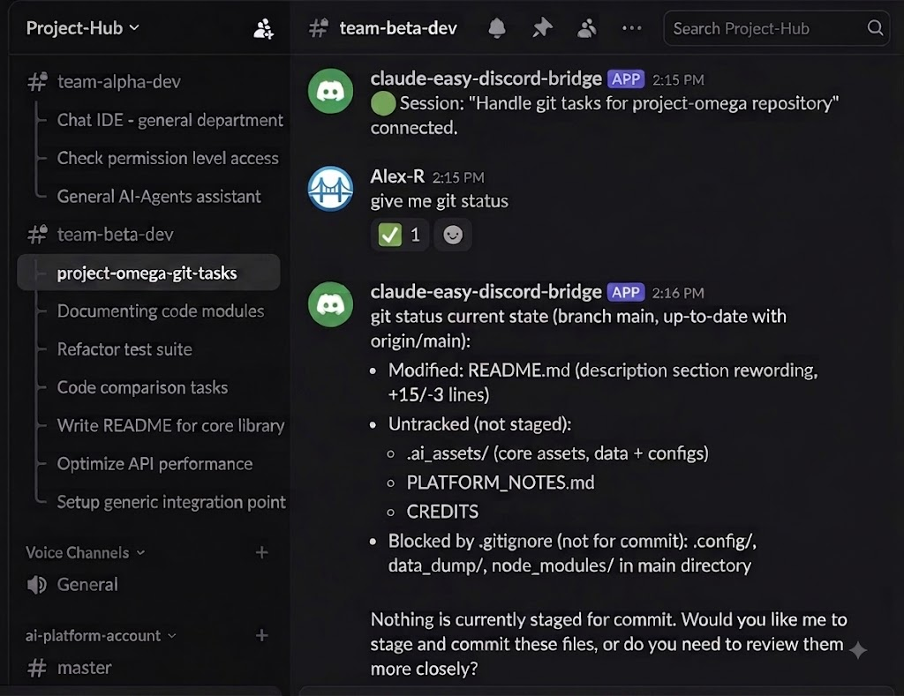

<div align="center">

# 🌉 Claude Easy Discord Bridge

*(technical name of the skill/directory: `claude-easy-discord-bridge`)*

**English** · [Tiếng Việt](README.vi.md) · [日本語](README.ja.md) · [中文](README.zh.md)

**Control Claude Code right from Discord — even from your phone.**

A skill for [Claude Code](https://claude.com/claude-code) that turns every
running session into a Discord conversation: send messages, watch progress —
anytime, anywhere, without sitting in front of VSCode. Run **multiple tasks
across multiple projects at the same time** and everything still stays
clearly separated, with no risk of mixing things up.

</div>

---

## 📌 Why do you need this?

By default, Claude Code only runs inside a single terminal/VSCode window —
you either have to sit there waiting, or you lose your connection to the
session the moment you step away from the machine. This skill solves exactly
that problem.

> 🔌 **What makes it special:** no setup or configuration needed in advance.
> If you're in the middle of a conversation with Claude working on something,
> just type **"connect to discord"** right in that same conversation and it
> connects immediately — no need to stop what you're doing, no need to start
> over. This is something **only this skill can do**: most other
> Discord plugins/bots require you to initiate a work session through them
> from the very start — they can't "attach" Discord to a conversation that's
> already underway.

| Without the skill | With Claude Easy Discord Bridge |
|---|---|
| In the middle of a conversation with Claude, and to use Discord you have to stop and start a new session from scratch | Type "connect to discord" mid-task, no loss of context, no need to restart |
| Multiple sessions running in parallel → easy to lose track of which window is which | Each session gets its own thread with a clear name — never confused |
| Multiple projects → many places to open and keep track of | Each project gets its own channel — fully separated |
| Want to ask Claude a quick question → have to reopen the IDE | Type straight into Discord, Claude answers right in the thread |
| Have to sit at the machine to watch Claude work | Follow along and reply right from your phone via Discord |

## ✨ Key features

### 🧵 Multiple tasks, multiple projects at once — and still dead simple
This is the skill's biggest strength: you can have several different Claude
Code conversations open at once (e.g. fixing a bug in project A while
writing a report in project B) **at the same time**, and on Discord
everything stays neatly organized:

- Each **project** shows up as **its own Discord channel** — work on
  project A never gets mixed into project B.
- Within each channel, each **running conversation** shows up as **its own
  thread**, automatically named after the task at hand (e.g. "fix login
  bug", "analyze report") — no matter how many tasks you have running at
  once, you never risk messaging the wrong place: just go to the right
  thread and you're talking to the right task.
- No manual management or naming required — everything is organized
  automatically as soon as you say "connect to Discord."

### 💬 Real-time two-way messaging
Type a message in the Discord thread, and Claude Code picks it up and
replies almost instantly — no slow polling, no need to refresh.

### ✅ Clear processing status via reactions
Reacts with 🤔 as soon as it starts processing a message, and changes to
✅ when done — one glance at Discord tells you whether Claude is busy or has
already replied.

### 🔁 Resumes the same thread, never creates duplicates
Reconnecting to the same session (reopening the same conversation)
automatically finds the thread that was already created for it — it never
spawns a duplicate thread.

### 🚦 Flexible disconnecting
Disconnect a single session, or disconnect an entire project (with a
warning if other sessions are still alive) — always explicit, with no
hidden auto-disconnect mechanism.

### ⚡ Fast, with no tangled dependencies
Sending messages uses REST directly, not the Gateway — the send direction
is never blocked even if the receive direction is having trouble. Backed
by real performance measurements, not guesswork.

## 🏆 Standout advantages

- **🔌 Install once, use forever — connect mid-task, no prep needed.**
  You only need to install it once. After that, at any point — even while
  you're in the middle of a conversation with Claude on some task — just
  type **"connect to discord"** right in that same conversation and it
  connects immediately, no need to stop what you're doing, no need to start
  over, no extra configuration required. This is something **only this
  skill can do**: other Discord plugins/bots usually require you to
  initiate the work session through them from the very start — they don't
  support "attaching" Discord to a conversation that's **already in
  progress**.

- **📱 Genuine remote work, not just passive notifications.** Claude Code's
  built-in mobile notification feature only lets you *know* that Claude
  needs something — to actually respond you still have to get back to the
  computer where it's running. With this skill, you **reply and keep the
  task moving right from your phone**, just as if you were sitting at the
  computer typing commands.

- **🗂️ Never mix up tasks, even with several running at once.** Each Claude
  Code conversation is a separate thread, clearly named after the task at
  hand (e.g. "fix login bug", "write report"). Running 3-4 tasks in
  parallel still stays clearly separated — no risk of replying to the wrong
  conversation.

- **🏢 Multiple projects, each with its own space.** If you work on several
  different projects, each one shows up as its own Discord channel — no
  mixing work from one project into another.

- **⚡ Fast replies, no waiting or reloading.** As soon as you finish typing
  a message, Claude receives it almost instantly — no need to hit refresh
  or wait through a slow polling loop.

- **✅ One glance tells you whether Claude is busy or done.** Every message
  you send automatically gets a 🤔 icon while Claude is processing it, and
  it changes to ✅ when done — no need to ask "done yet?".

- **🔒 Private, no third party involved.** All messages go directly between
  your machine and your own Discord — no intermediary server stores or can
  read the conversation content.

- **🧠 No technical knowledge required to use it.** Just type one simple
  sentence, **"connect to Discord"**, and Claude handles everything else —
  no commands to run, no need to understand how it works internally.

- **🔁 Install once, use forever.** The initial setup takes only a few
  minutes, and after that every new conversation is automatically ready to
  connect to Discord without setting it up again.

## ⚖️ Compared to the official Discord plugin (`discord@claude-plugins-official`)

Anthropic also has an official Discord plugin (an MCP server running on
Bun, integrated via `claude --channels`). This skill takes a different,
simpler direction that hews closer to actual multi-project/multi-session
needs:

- **Attaches Discord to a conversation that's already in progress.** Just
  type "connect to discord" right in the running session and you're done —
  no need to know in advance that you'll need Discord, no restart or
  configuration required before starting the task. The official plugin
  (and most other Discord bots) require you to set up the channel/work
  session through them from the very start.
- **Automatically maps 1 project ↔ 1 channel, 1 session ↔ 1 thread.** The
  official plugin has no such mechanism built in — you have to manage
  threading manually via `reply_to`.
- **Sending and receiving are fully decoupled.** `send.js` calls REST
  directly, 100% independent from the receive direction — even if the
  listener that receives messages is having trouble, sending is never
  blocked. The official plugin bundles everything into 1 MCP server.
- **No need for Bun, no MCP, no `--channels` flag.** Just Node.js >= 18
  (which you likely already have) plus `npm install` in the skill
  directory.
- **Minimal setup.** A single `.env` file declaring the token + IDs, no
  need to run configuration slash commands (`/discord:configure`,
  `/discord:access ...`) or go through a pairing-code step.
- **Backed by real on-machine performance measurements, not guesswork**
  (node startup ~85ms, 1 Discord REST call ~0.4–0.66s, `fs.watch`
  detecting a new message ~14ms) — and an earlier attempt to optimize by
  batching REST calls was reverted because it caused a race
  condition/429s, so the current design has been validated in practice
  rather than just in theory.
- **Tied to each individual project, not a global configuration.** To use
  it in another project, just copy the skill directory over — it doesn't
  touch the machine-wide Claude Code configuration.

## 🖼️ Demo



## 🏗️ Architecture overview

```
Project A                              Project B
   │                                       │
   ├─ Discord Channel A                    ├─ Discord Channel B
   │    ├─ Thread: session 1               │    ├─ Thread: session 1
   │    └─ Thread: session 2               │    └─ Thread: session 2
   │                                       │
   └─ discord-listener.js (1 process)      └─ discord-listener.js (1 process)
        shared by every session                 shared by every session
```

For the full details (components, connect/send/receive/disconnect flows,
the reasoning behind each design decision, real measured performance
numbers): see
[docs/claude-easy-discord-bridge-architecture.md](.claude/skills/claude-easy-discord-bridge/docs/claude-easy-discord-bridge-architecture.md).

## 🚀 Installation

**Requires: Node.js >= 18** (check with `node -v`). The scripts call the
Discord REST API using the global `fetch`, which is only available from
Node 18 onward — Node 16 and below will throw `fetch is not defined`.

```bash
cd .claude/skills/claude-easy-discord-bridge
npm install
```

Create a `.env` file right in this skill's directory:

```env
DISCORD_BOT_TOKEN=...
DISCORD_SERVER_ID=...
DISCORD_CHANNEL_ID=...
ALLOWED_USER_IDS=111,222,333
```

The Discord bot needs:
- Permissions: `View Channel`, `Send Messages`, `Create Public Threads`,
  `Send Messages in Threads` on the parent channel.
- **Message Content Intent** enabled in the Discord Developer Portal.

> Want to use this in another project? Just copy the entire
> `.claude/skills/claude-easy-discord-bridge/` directory into that
> project's `.claude/skills/` and reconfigure `.env`.

## 🎮 Usage

No need to run scripts yourself — just ask Claude:

> "Connect to Discord"

Claude will read the skill and run the exact sequence of commands needed
(`ensure-thread.js` → `listen-message.js` → `send.js` → `react.js`),
automatically looping through listen/reply until you ask it to disconnect.
These commands always run through Bash (even on Windows — not PowerShell,
since PowerShell 5.1 tends to mangle Vietnamese diacritics/emoji when
passing arguments to `node.exe`). For the full details on commands and
required rules, see
[SKILL.md](.claude/skills/claude-easy-discord-bridge/SKILL.md).

## ✅ Status

Fully coded and **tested end-to-end against a real Discord** (not a mock):
creating threads, sending/receiving messages, reacting, and
disconnecting/resuming sessions have all been verified working correctly.

## 📄 License

Released under the [Apache License 2.0](LICENSE) — free to use, modify,
and redistribute, including for commercial purposes, as long as the
copyright notice is retained.

## 👤 Author

**dangntvn** — [dangnt.vn@gmail.com](mailto:dangnt.vn@gmail.com)
